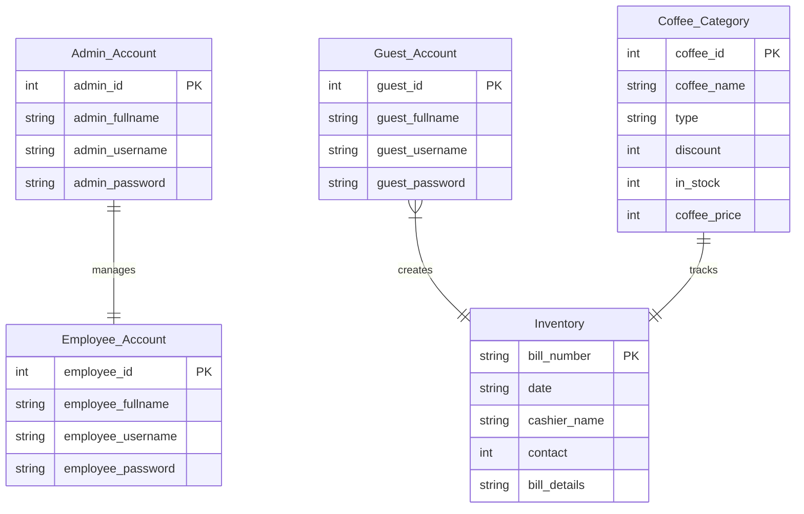

## Entity-Relationship Diagram Explanation

### Entities and Their Relationships

1. **Admin_Account**
   - Primary role: System administration
   - Manages employee accounts
   - Contains administrative user credentials
   - Relationship: One-to-One with Employee_Account

2. **Employee_Account**
   - Represents staff members who can access the system
   - Contains employee credentials
   - Managed by Admin_Account
   - Likely responsible for sales and inventory management

3. **Guest_Account**
   - Represents customers or users with limited access
   - Can potentially create transactions
   - Relationship with Inventory suggests they might initiate or be associated with sales

4. **Coffee_Category**
   - Stores information about different coffee types
   - Includes details like price, discount, stock
   - Tracks inventory of coffee products
   - Relationship with Inventory suggests it provides details for sales transactions

5. **Inventory**
   - Acts as a sales transaction log
   - Captures bill details, date, cashier, and contact information
   - Connected to Coffee_Category to track which products were sold
   - Can be linked to Guest_Account or Employee_Account who made the sale

### Key Observations
- The database is designed for a coffee shop management system
- Supports multiple user roles (Admin, Employee, Guest)
- Tracks coffee inventory and sales transactions
- Provides a comprehensive system for managing coffee shop operations

### Potential Improvements
- Add foreign key constraints
- Create more explicit relationships between tables
- Implement more detailed tracking of inventory changes
